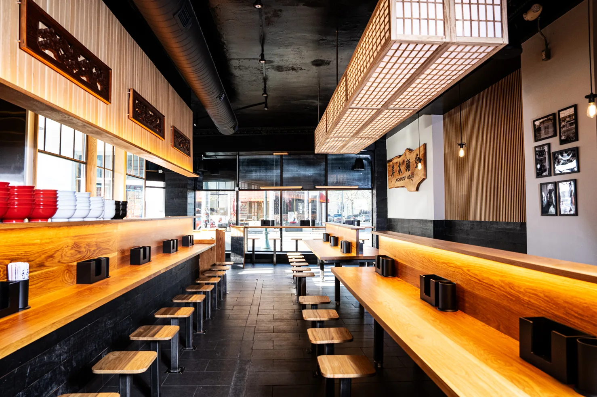

# _KISHIMOTO MENDO_

>  We are an independently owned ramen restaurant based in STL, specializing in Tonkotsu Ramen! This is the brand new sister location of Menya Rui, which is our highly recognized and acclaimed shoyu shop. 

> ### Address: 6394 Delmar Blvd, University City, MO 63130 
> ### Phone: [(314) 932-7931](https://www.google.com/search?sca_esv=8b4659d1f6f28da8&sxsrf=APpeQnspEym5b7GfjjML_8-Yr6srpxuIag:1788466852506&q=kishimoto+mendo&source=lnms&fbs=ABfTbFUxGEP8yeZbmk97ajdTjIq-1SYeWocr-JQ01ak8-2VFVc-G1_pZrygIAtw89UfRnn2eiwSHixiIIsfiYWQ87Bvdrhu-1WpVLSrHB0fZR4Dpor-12anvpeSJN5U0m9C45W0grLPpYxyxn4ed_zK6WfKmzTWGf-cDPuS20oBtjzsdCn2XYl3VtG9EkS2c-smi357_3rdfZANtM-jdJCY9lnQAms3kbEPCGKQcRo33CIwc_qtMs6g&sa=X&ved=2ahUKEwjThr6bntOWAxUdnysGHQp8MoAQ0pQJegQIEBAB&biw=1318&bih=923&dpr=2#)
> ### Hours: Sun-Sat 11AM-9PM --- Closed on Tuesdays!

## Menu: 
### APPETIZERS
**Shishito Peppers --** flash fried, ponzu, katsuobushi .
`$5`

**Japanese Potato Salad --** 
mashed yukons with kewpie, cucumber, carrot, corn, cripsy shallot topping . 
`$5`

**Chashu Rice Bowl --** 
chopped chashu on rice will scallion, ramen egg, nori, and scallion . 
`$8`

### DRINKS
**Oolong Tea can --**
`$3`

**Green Tea can --**
`$3`

**Excel Bottled Soda --**
`$3`

### TSUKEMEN
>Japanese ramen dish where cooked, chewy noodles are served in a separate bowl from a rich, concentrated dipping broth

**Gyokau Tsukemen Classic --** concentrated seafood infused pork bone borth served aside cold rinsed thick noodles, topped with pork belly chashu, kikurage, menma, scallion, and nori .
`$17`

**Red Tsukemen --** 
classic flavored with spicy miso . 
`$18`

### MAZEMEN
>Brothless Ramen

**Aburasoba --** thick noodles tossed in smoked seafood infused lard, topped with pork belly chashu, menman, gyofun, scallion, and nori .
`$16`

**Taiwan Mazesoba --** 
concentrated seafood infused pork bone borth served aside cold rinsed thick noodles, topped with pork belly chashu, kikurage, menma, scallion, and nori . 
`$18`

### RAMEN
>What you came here for!

**Tonkotsu Classic --** rich pork bone broth with thin hakata style noodles, topped with pork belly chashu, kikurage, scallion, and pickled red ginger .
`$16`

**Tonkotsu Black --** 
classic with addition of roasted garlic oil . 
`$17`

**Gyokai Tonkotsu Classic --** rich seafood infused pork bone broth with thick lekei style noodles, topped with pork belly chashu, kikurage, menma, scallion, and nori .
`$18`

**Gyokai Black --** classic with addition of roasted garlic oil . 
`$19`

**Gyokai Red --** classic with addition of spicy miso topping . 
`$20`