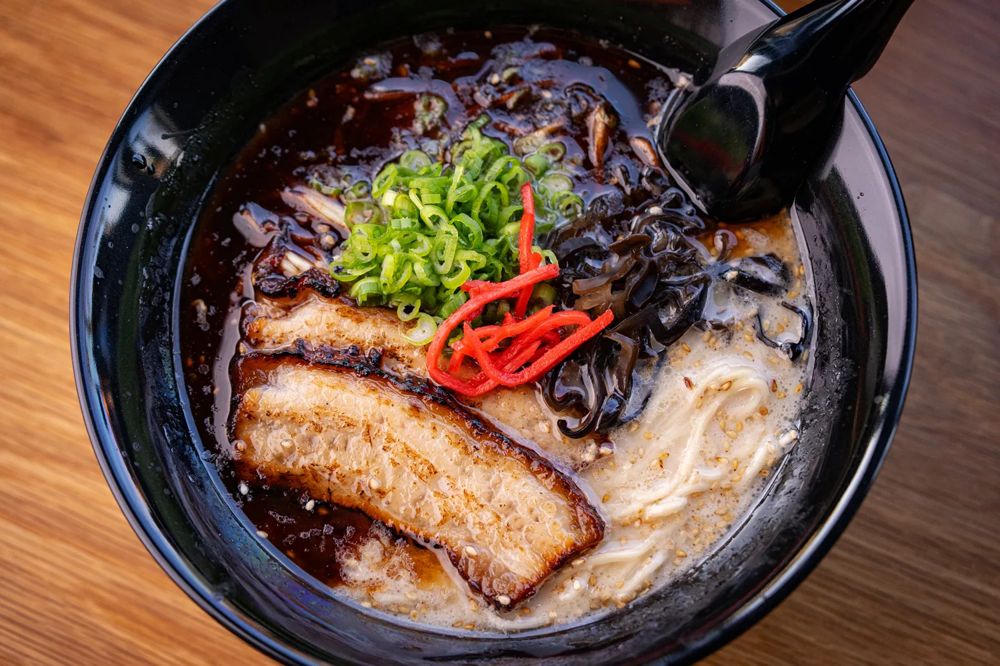

##### RESTAURANT

# KISHIMOTO MENDO
> _Japanese restaurant specializing in handmade noodles and traditional dishes._

4.6 ⭐️⭐️⭐️⭐️⭐️ · 11AM-9PM Daily (Closed on Tuesdays)

**Address:** 6394 Delmar Blvd, University City, MO 63130

**Phone:** [(314) 932-7931](https://www.google.com/search?sca_esv=8b4659d1f6f28da8&sxsrf=APpeQnspEym5b7GfjjML_8-Yr6srpxuIag:1788466852506&q=kishimoto+mendo&source=lnms&fbs=ABfTbFUxGEP8yeZbmk97ajdTjIq-1SYeWocr-JQ01ak8-2VFVc-G1_pZrygIAtw89UfRnn2eiwSHixiIIsfiYWQ87Bvdrhu-1WpVLSrHB0fZR4Dpor-12anvpeSJN5U0m9C45W0grLPpYxyxn4ed_zK6WfKmzTWGf-cDPuS20oBtjzsdCn2XYl3VtG9EkS2c-smi357_3rdfZANtM-jdJCY9lnQAms3kbEPCGKQcRo33CIwc_qtMs6g&sa=X&ved=2ahUKEwjThr6bntOWAxUdnysGHQp8MoAQ0pQJegQIEBAB&biw=1318&bih=923&dpr=2#) 

**Instagram:** [@kishimoto_stl](https://www.instagram.com/kishimoto_stl/)

---

---
## MENU:

### APPETIZERS
---
### Shishito Peppers ··· $5

_flash fried, ponzu, katsuobushi_ 

### Japanese Potato Salad ··· $5

_mashed yukons with kewpie, cucumber, carrot, corn, cripsy shallot topping_ 

### Chashu Rice Bowl ··· $8

_chopped chashu on rice will scallion, ramen egg, nori, and scallion_

---

### DRINKS
---
### Oolong Tea Can ··· $3

### Green Tea Can ··· $3

### Excel Bottled Soda ··· $3
---
### TSUKEMEN
---
> _Japanese ramen dish where cooked, chewy noodles are served in a separate bowl from a rich, concentrated dipping broth_
---
---
### Gyokai Tsukemen Classic ··· $17

_concentrated seafood infused pork bone borth served aside cold rinsed thick noodles, topped with pork belly chashu, kikurage, menma, scallion, and nori_

### Red Tsukemen ··· $18

_classic flavored with spicy miso_

---
### MAZEMEN
---
>_Brothless Ramen_
---
---
### Aburasoba ··· $16

_thick noodles tossed in smoked seafood infused lard, topped with pork belly chashu, menman, gyofun, scallion, and nori_

### Taiwan Mazesoba ··· $18

_concentrated seafood infused pork bone borth served aside cold rinsed thick noodles, topped with pork belly chashu, kikurage, menma, scallion, and nori_

---
### RAMEN
---
>_What you came here for!_
---
---

### Tonkotsu Classic ··· $16 

_rich pork bone broth with thin hakata style noodles, topped with pork belly chashu, kikurage, scallion, and pickled red ginger_

### Tonkotsu Black ··· $17

_classic with addition of roasted garlic oil_

### Gyokai Tonkotsu Classic ··· $18

_rich seafood infused pork bone broth with thick lekei style noodles, topped with pork belly chashu, kikurage, menma, scallion, and nori_

### Gyokai Black ··· $19

_classic with addition of roasted garlic oil_

### Gyokai Red ··· $20

_classic with addition of spicy miso topping_
